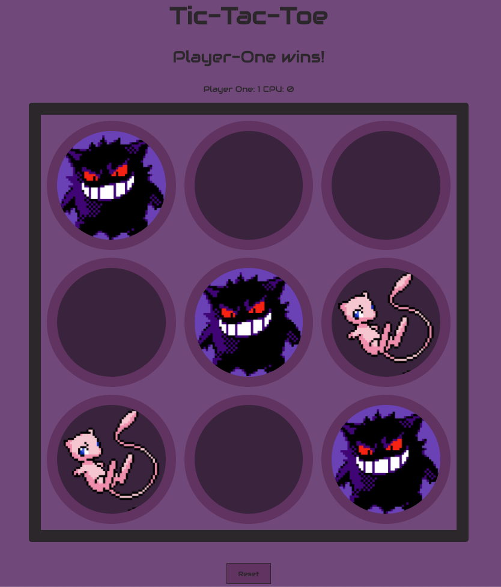

# Tic-Tac-Toe

This is Ben Luck's project, built as part of the Software Engineering Immersive Course at General Assembly, Sydney.

## How it was built

I used HTML, CSS, JavaScript and jQuery to build this game.

## Link

https://benl798.github.io/tictactoe/

## How to play

> This game is a classic that takes seconds to learn but minutes to master!

You have been assigned the character 'Gengar' and will take turns playing against the CPU - 'Mew'. To win you must be the first to align three of your symbols in a row, column or diagonally.

The game will track the number of games both you and the CPU has won. To reset the board and play again simply click the 'Reset' button (don't worry this won't clear the score count).

## My experience developing the game

This has been my first experience developing my own project from scratch and what an experience it has been! The development of the game proved to be both challenging and rewarding and I am proud to share my final result!

The exposure to some key technologies has been a valuable experience and although there is a lot to be done to optimise and clean the code up I believe this project has set the platform for me to analyse and develop my skills with the intention of creating and contributing to many more projects in the future!  

Enjoy!

